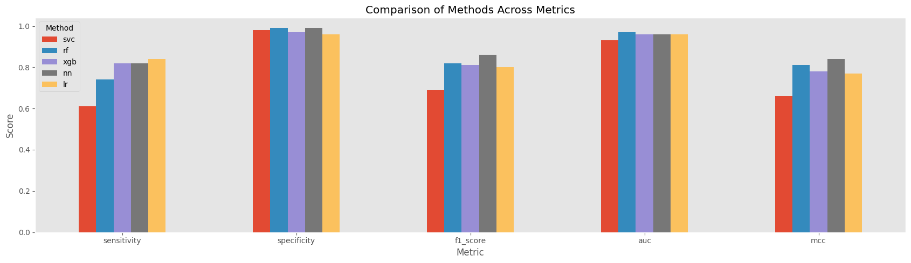

# Statistical and Predictive Analysis of Hepatitis C dataset

Author: Khadija Musayeva

The current report represents statistical and predictive modeling done on the Hepatitis C dataset publicly available at UCI website https://archive.ics.uci.edu/dataset/571/hcv+data.

The dataset consists of 615 patients characterized by age, sex, and laboratory tests values of 10 biochemical blood test markers. The target consists of 4 classes: Blood Donor, Hepatitis-C, Fibrosis, Cirrhosis.

Statistical analysis consists of the analysis of distribution of variables, prevalence of disease cases across variables, and adjusted odds ratio analysis.

Predictive modeling firtst discriminates all disease cases aggregated into one from blood donors and secondly, all four classes from each other.

F1, AUC, sensitivity, specificity, Matthews correlations coefficients are used as evaluation measures in the binary classification setting, and macro and micro F1 measures and Matthews correlation coefficient are used as evaluation measures in the multi-class classification setting. In both setting, the models are trained based on the Matthews correlation coefficient which evaluates the confusion matrix in ints entirety.

We use Optuna framework for hyperparameter training. 

Half of the data is used as training set and the other half as a test set.

Predictive methods used are logistic regression, support vector machine, random forest, xgboost and neural networks.

In the binary setting, logistic regression has a higher sensitivity, and random forest and neural networks have higher specificities.

In the multi-class classification setting,  logistic regression makes fewer errors in predicting hepatitis C and fibrosis cases, and equally well as neural network in predicting cirrhosis cases. However, it misclassifies many blood donors as disease cases.

It should be noted that quantitave models like logistic regression is supported by Arden Syntax which programs medical logic for clinical decision support, but not black box models of higher capacity such as random forests or neural networks.

# Visualization

Here we load the cleaned version of the data.


```python
from DataProcess import *
from DataVisualize import *
from BinaryClassificationTraining import *
from BinaryClassificationEvaluation import *
from MultiClassificationTraining import *
from MultiClassificationEvaluation import *
```


```python
dp = DataProcess("data/HepatitisCdata.csv")
data_vis = DataVisualize(dp)
df = dp.getFinalData()
```

    File read successfully: data/HepatitisCdata.csv


## Distribution of Target Variable

This is a dataset with high class imbalance, where only 12% of observations are disease cases.


```python
data_vis.Target()
```


    

    


## Age and Disease

The minimum and maximum ages in the dataset are 19 and 77, respectively. The mean age is 47. There are few individuals between 19 and 30 years of age. As the plot below demonstrates, these younger individuals are Hepatitis C patients.


```python
df["Age"].describe()
```


    count    615.000000
    mean      47.408130
    std       10.055105
    min       19.000000
    25%       39.000000
    50%       47.000000
    75%       54.000000
    max       77.000000
    Name: Age, dtype: float64


If we consider only binary target variable corresponding to healthy vs disease cases, there is much crossover between the class conditional age distributions. However, separated by disease severity, hepatitis C patients, in general, are younger than fibrosis and cirrhosis patiens with the minimum age of 19 and the median age of 37. The age distribution of cirrhosis patients is negatively skewed with median of 56 and with all its percentiles higher than those of fibrosis patients. The percentiles of hepatitis are lower than that of healthy individuals and the percentiles of the age distributions of fibrosis and cirrhosis patients are higher than that of healthy individuals. Thus, the age distribution for the  aggregated disease status displays high variance, with much crossover with that of healthy individuals.


```python
df[["Age", "Diagnosis"]].groupby("Diagnosis").describe()
```


<div>
<style scoped>
    .dataframe tbody tr th:only-of-type {
        vertical-align: middle;
    }

    .dataframe tbody tr th {
        vertical-align: top;
    }

    .dataframe thead tr th {
        text-align: left;
    }

    .dataframe thead tr:last-of-type th {
        text-align: right;
    }
</style>
<table border="1" class="dataframe">
  <thead>
    <tr>
      <th></th>
      <th colspan="8" halign="left">Age</th>
    </tr>
    <tr>
      <th></th>
      <th>count</th>
      <th>mean</th>
      <th>std</th>
      <th>min</th>
      <th>25%</th>
      <th>50%</th>
      <th>75%</th>
      <th>max</th>
    </tr>
    <tr>
      <th>Diagnosis</th>
      <th></th>
      <th></th>
      <th></th>
      <th></th>
      <th></th>
      <th></th>
      <th></th>
      <th></th>
    </tr>
  </thead>
  <tbody>
    <tr>
      <th>Blood Donor</th>
      <td>540.0</td>
      <td>47.266667</td>
      <td>9.704311</td>
      <td>32.0</td>
      <td>39.0</td>
      <td>47.0</td>
      <td>54.0</td>
      <td>77.0</td>
    </tr>
    <tr>
      <th>Cirrhosis</th>
      <td>30.0</td>
      <td>53.466667</td>
      <td>8.908475</td>
      <td>38.0</td>
      <td>46.0</td>
      <td>56.0</td>
      <td>59.0</td>
      <td>74.0</td>
    </tr>
    <tr>
      <th>Fibrosis</th>
      <td>21.0</td>
      <td>52.333333</td>
      <td>11.438240</td>
      <td>29.0</td>
      <td>48.0</td>
      <td>51.0</td>
      <td>57.0</td>
      <td>75.0</td>
    </tr>
    <tr>
      <th>Hepatitis</th>
      <td>24.0</td>
      <td>38.708333</td>
      <td>11.350078</td>
      <td>19.0</td>
      <td>31.5</td>
      <td>37.0</td>
      <td>47.0</td>
      <td>61.0</td>
    </tr>
  </tbody>
</table>
</div>


```python
data_vis.AgeDisease()
```


    

    


## Gender and Disease

In the dataset, 61% percent of individuals are males.


```python
gender_counts = df['Sex'].value_counts().sort_index()

display(round(100 * gender_counts / gender_counts.sum(), 2))
```


    Sex
    f    38.7
    m    61.3
    Name: count, dtype: float64


There are more hepatitis C and cirrhosis cases among males.


```python
 gender_diagnosis = (df.groupby(['Sex', 'Diagnosis'])
    .size()
    .groupby(level=0)
    .apply(lambda x: round(100 * x / x.sum(), 2))
    .reset_index(level=0, drop=True)
  )

 display(gender_diagnosis.reset_index(name="Percentage")\
         .sort_values(by=['Diagnosis', 'Sex'], key=lambda x: x.map(dp.diagnosis_dict)))
```


<div>
<style scoped>
    .dataframe tbody tr th:only-of-type {
        vertical-align: middle;
    }

    .dataframe tbody tr th {
        vertical-align: top;
    }

    .dataframe thead th {
        text-align: right;
    }
</style>
<table border="1" class="dataframe">
  <thead>
    <tr style="text-align: right;">
      <th></th>
      <th>Sex</th>
      <th>Diagnosis</th>
      <th>Percentage</th>
    </tr>
  </thead>
  <tbody>
    <tr>
      <th>0</th>
      <td>f</td>
      <td>Blood Donor</td>
      <td>90.76</td>
    </tr>
    <tr>
      <th>4</th>
      <td>m</td>
      <td>Blood Donor</td>
      <td>85.94</td>
    </tr>
    <tr>
      <th>3</th>
      <td>f</td>
      <td>Hepatitis</td>
      <td>1.68</td>
    </tr>
    <tr>
      <th>7</th>
      <td>m</td>
      <td>Hepatitis</td>
      <td>5.31</td>
    </tr>
    <tr>
      <th>2</th>
      <td>f</td>
      <td>Fibrosis</td>
      <td>3.36</td>
    </tr>
    <tr>
      <th>6</th>
      <td>m</td>
      <td>Fibrosis</td>
      <td>3.45</td>
    </tr>
    <tr>
      <th>1</th>
      <td>f</td>
      <td>Cirrhosis</td>
      <td>4.20</td>
    </tr>
    <tr>
      <th>5</th>
      <td>m</td>
      <td>Cirrhosis</td>
      <td>5.31</td>
    </tr>
  </tbody>
</table>
</div>


```python
data_vis.GenderDisease()
```


    

    


## Biomarkers and Disease

Before visualization, we need to verify which variables have missing values.
ALP predictor has 18 missing values, all in disease individuals. Given small number of observations in disease classes, this variable is not a reliable predictor. CHOL has more missing values in healthy individuals. One hepatitis patient is missing ALT value, and one cirrhosis patient is missing PROT value.

Because there is a high biological variability between individuals, from precision medecine point of view, would it be a right strategy to impute these values, for instance, using k-nearest neighbour approach? In predictive modeling, we drop ALP predictor altogether.


```python
df.loc[df.isna().any(axis=1)]
```


  <div id="df-cd66d5f2-a8ee-4e25-9730-e30a9743a2f2" class="colab-df-container">
    <div>
<style scoped>
    .dataframe tbody tr th:only-of-type {
        vertical-align: middle;
    }

    .dataframe tbody tr th {
        vertical-align: top;
    }

    .dataframe thead th {
        text-align: right;
    }
</style>
<table border="1" class="dataframe">
  <thead>
    <tr style="text-align: right;">
      <th></th>
      <th>Diagnosis</th>
      <th>Age</th>
      <th>Sex</th>
      <th>ALB</th>
      <th>ALP</th>
      <th>ALT</th>
      <th>AST</th>
      <th>BIL</th>
      <th>CHE</th>
      <th>CHOL</th>
      <th>CREA</th>
      <th>GGT</th>
      <th>PROT</th>
      <th>Diagnosis_Label</th>
      <th>Diagnosis_Binary</th>
    </tr>
  </thead>
  <tbody>
    <tr>
      <th>121</th>
      <td>0</td>
      <td>43</td>
      <td>m</td>
      <td>48.6</td>
      <td>45.0</td>
      <td>10.5</td>
      <td>40.5</td>
      <td>5.3</td>
      <td>7.09</td>
      <td>NaN</td>
      <td>63.0</td>
      <td>25.1</td>
      <td>70.0</td>
      <td>Blood Donor</td>
      <td>0</td>
    </tr>
    <tr>
      <th>319</th>
      <td>0</td>
      <td>32</td>
      <td>f</td>
      <td>47.4</td>
      <td>52.5</td>
      <td>19.1</td>
      <td>17.1</td>
      <td>4.6</td>
      <td>10.19</td>
      <td>NaN</td>
      <td>63.0</td>
      <td>23.0</td>
      <td>72.2</td>
      <td>Blood Donor</td>
      <td>0</td>
    </tr>
    <tr>
      <th>329</th>
      <td>0</td>
      <td>33</td>
      <td>f</td>
      <td>42.4</td>
      <td>137.2</td>
      <td>14.2</td>
      <td>13.1</td>
      <td>3.4</td>
      <td>8.23</td>
      <td>NaN</td>
      <td>48.0</td>
      <td>25.7</td>
      <td>74.4</td>
      <td>Blood Donor</td>
      <td>0</td>
    </tr>
    <tr>
      <th>413</th>
      <td>0</td>
      <td>46</td>
      <td>f</td>
      <td>42.9</td>
      <td>55.1</td>
      <td>15.2</td>
      <td>29.8</td>
      <td>3.6</td>
      <td>8.37</td>
      <td>NaN</td>
      <td>61.0</td>
      <td>29.0</td>
      <td>71.9</td>
      <td>Blood Donor</td>
      <td>0</td>
    </tr>
    <tr>
      <th>424</th>
      <td>0</td>
      <td>48</td>
      <td>f</td>
      <td>45.6</td>
      <td>107.2</td>
      <td>24.4</td>
      <td>39.0</td>
      <td>13.8</td>
      <td>9.77</td>
      <td>NaN</td>
      <td>88.0</td>
      <td>38.0</td>
      <td>75.1</td>
      <td>Blood Donor</td>
      <td>0</td>
    </tr>
    <tr>
      <th>433</th>
      <td>0</td>
      <td>48</td>
      <td>f</td>
      <td>46.8</td>
      <td>93.3</td>
      <td>10.0</td>
      <td>23.2</td>
      <td>4.3</td>
      <td>12.41</td>
      <td>NaN</td>
      <td>52.0</td>
      <td>23.9</td>
      <td>72.4</td>
      <td>Blood Donor</td>
      <td>0</td>
    </tr>
    <tr>
      <th>498</th>
      <td>0</td>
      <td>57</td>
      <td>f</td>
      <td>48.4</td>
      <td>94.4</td>
      <td>2.5</td>
      <td>39.6</td>
      <td>2.3</td>
      <td>8.84</td>
      <td>NaN</td>
      <td>82.0</td>
      <td>6.4</td>
      <td>76.8</td>
      <td>Blood Donor</td>
      <td>0</td>
    </tr>
    <tr>
      <th>540</th>
      <td>1</td>
      <td>38</td>
      <td>m</td>
      <td>45.0</td>
      <td>56.3</td>
      <td>NaN</td>
      <td>33.1</td>
      <td>7.0</td>
      <td>9.58</td>
      <td>6.0</td>
      <td>77.9</td>
      <td>18.9</td>
      <td>63.0</td>
      <td>Hepatitis</td>
      <td>1</td>
    </tr>
    <tr>
      <th>541</th>
      <td>1</td>
      <td>19</td>
      <td>m</td>
      <td>41.0</td>
      <td>NaN</td>
      <td>87.0</td>
      <td>67.0</td>
      <td>12.0</td>
      <td>7.55</td>
      <td>3.9</td>
      <td>62.0</td>
      <td>65.0</td>
      <td>75.0</td>
      <td>Hepatitis</td>
      <td>1</td>
    </tr>
    <tr>
      <th>545</th>
      <td>1</td>
      <td>29</td>
      <td>m</td>
      <td>49.0</td>
      <td>NaN</td>
      <td>53.0</td>
      <td>39.0</td>
      <td>15.0</td>
      <td>8.79</td>
      <td>3.6</td>
      <td>79.0</td>
      <td>37.0</td>
      <td>90.0</td>
      <td>Hepatitis</td>
      <td>1</td>
    </tr>
    <tr>
      <th>546</th>
      <td>1</td>
      <td>30</td>
      <td>m</td>
      <td>45.0</td>
      <td>NaN</td>
      <td>66.0</td>
      <td>45.0</td>
      <td>14.0</td>
      <td>12.16</td>
      <td>6.1</td>
      <td>86.0</td>
      <td>43.0</td>
      <td>77.0</td>
      <td>Hepatitis</td>
      <td>1</td>
    </tr>
    <tr>
      <th>568</th>
      <td>2</td>
      <td>49</td>
      <td>m</td>
      <td>39.0</td>
      <td>NaN</td>
      <td>118.0</td>
      <td>62.0</td>
      <td>10.0</td>
      <td>7.28</td>
      <td>3.5</td>
      <td>72.0</td>
      <td>74.0</td>
      <td>81.0</td>
      <td>Fibrosis</td>
      <td>1</td>
    </tr>
    <tr>
      <th>569</th>
      <td>2</td>
      <td>49</td>
      <td>m</td>
      <td>46.0</td>
      <td>NaN</td>
      <td>114.0</td>
      <td>75.0</td>
      <td>16.0</td>
      <td>10.43</td>
      <td>5.2</td>
      <td>72.0</td>
      <td>59.0</td>
      <td>82.0</td>
      <td>Fibrosis</td>
      <td>1</td>
    </tr>
    <tr>
      <th>570</th>
      <td>2</td>
      <td>50</td>
      <td>m</td>
      <td>42.0</td>
      <td>NaN</td>
      <td>258.0</td>
      <td>106.0</td>
      <td>15.0</td>
      <td>8.74</td>
      <td>4.7</td>
      <td>77.0</td>
      <td>80.0</td>
      <td>84.0</td>
      <td>Fibrosis</td>
      <td>1</td>
    </tr>
    <tr>
      <th>571</th>
      <td>2</td>
      <td>53</td>
      <td>m</td>
      <td>46.0</td>
      <td>NaN</td>
      <td>34.0</td>
      <td>43.0</td>
      <td>14.0</td>
      <td>8.77</td>
      <td>4.0</td>
      <td>112.0</td>
      <td>203.0</td>
      <td>76.0</td>
      <td>Fibrosis</td>
      <td>1</td>
    </tr>
    <tr>
      <th>576</th>
      <td>2</td>
      <td>71</td>
      <td>m</td>
      <td>37.0</td>
      <td>NaN</td>
      <td>130.0</td>
      <td>90.0</td>
      <td>15.0</td>
      <td>9.92</td>
      <td>4.7</td>
      <td>79.0</td>
      <td>77.0</td>
      <td>76.0</td>
      <td>Fibrosis</td>
      <td>1</td>
    </tr>
    <tr>
      <th>581</th>
      <td>2</td>
      <td>49</td>
      <td>f</td>
      <td>39.0</td>
      <td>NaN</td>
      <td>46.0</td>
      <td>39.0</td>
      <td>9.0</td>
      <td>10.21</td>
      <td>3.1</td>
      <td>89.0</td>
      <td>53.0</td>
      <td>79.0</td>
      <td>Fibrosis</td>
      <td>1</td>
    </tr>
    <tr>
      <th>582</th>
      <td>2</td>
      <td>51</td>
      <td>f</td>
      <td>37.0</td>
      <td>NaN</td>
      <td>164.0</td>
      <td>70.0</td>
      <td>9.0</td>
      <td>3.99</td>
      <td>4.2</td>
      <td>67.0</td>
      <td>43.0</td>
      <td>72.0</td>
      <td>Fibrosis</td>
      <td>1</td>
    </tr>
    <tr>
      <th>583</th>
      <td>2</td>
      <td>56</td>
      <td>f</td>
      <td>39.0</td>
      <td>NaN</td>
      <td>42.0</td>
      <td>34.0</td>
      <td>10.0</td>
      <td>7.75</td>
      <td>5.0</td>
      <td>80.0</td>
      <td>84.0</td>
      <td>78.0</td>
      <td>Fibrosis</td>
      <td>1</td>
    </tr>
    <tr>
      <th>584</th>
      <td>2</td>
      <td>75</td>
      <td>f</td>
      <td>36.0</td>
      <td>NaN</td>
      <td>114.0</td>
      <td>125.0</td>
      <td>14.0</td>
      <td>6.65</td>
      <td>NaN</td>
      <td>57.0</td>
      <td>177.0</td>
      <td>72.0</td>
      <td>Fibrosis</td>
      <td>1</td>
    </tr>
    <tr>
      <th>585</th>
      <td>3</td>
      <td>38</td>
      <td>m</td>
      <td>44.0</td>
      <td>NaN</td>
      <td>94.0</td>
      <td>60.0</td>
      <td>12.0</td>
      <td>4.37</td>
      <td>3.2</td>
      <td>61.0</td>
      <td>99.0</td>
      <td>77.0</td>
      <td>Cirrhosis</td>
      <td>1</td>
    </tr>
    <tr>
      <th>590</th>
      <td>3</td>
      <td>46</td>
      <td>m</td>
      <td>20.0</td>
      <td>NaN</td>
      <td>62.0</td>
      <td>113.0</td>
      <td>254.0</td>
      <td>1.48</td>
      <td>NaN</td>
      <td>114.0</td>
      <td>138.0</td>
      <td>NaN</td>
      <td>Cirrhosis</td>
      <td>1</td>
    </tr>
    <tr>
      <th>592</th>
      <td>3</td>
      <td>47</td>
      <td>m</td>
      <td>42.0</td>
      <td>NaN</td>
      <td>159.0</td>
      <td>102.0</td>
      <td>11.0</td>
      <td>6.29</td>
      <td>5.5</td>
      <td>58.0</td>
      <td>201.0</td>
      <td>79.0</td>
      <td>Cirrhosis</td>
      <td>1</td>
    </tr>
    <tr>
      <th>603</th>
      <td>3</td>
      <td>65</td>
      <td>m</td>
      <td>NaN</td>
      <td>NaN</td>
      <td>40.0</td>
      <td>54.0</td>
      <td>13.0</td>
      <td>7.50</td>
      <td>NaN</td>
      <td>70.0</td>
      <td>107.0</td>
      <td>79.0</td>
      <td>Cirrhosis</td>
      <td>1</td>
    </tr>
    <tr>
      <th>613</th>
      <td>3</td>
      <td>46</td>
      <td>f</td>
      <td>33.0</td>
      <td>NaN</td>
      <td>39.0</td>
      <td>62.0</td>
      <td>20.0</td>
      <td>3.56</td>
      <td>4.2</td>
      <td>52.0</td>
      <td>50.0</td>
      <td>71.0</td>
      <td>Cirrhosis</td>
      <td>1</td>
    </tr>
    <tr>
      <th>614</th>
      <td>3</td>
      <td>59</td>
      <td>f</td>
      <td>36.0</td>
      <td>NaN</td>
      <td>100.0</td>
      <td>80.0</td>
      <td>12.0</td>
      <td>9.07</td>
      <td>5.3</td>
      <td>67.0</td>
      <td>34.0</td>
      <td>68.0</td>
      <td>Cirrhosis</td>
      <td>1</td>
    </tr>
  </tbody>
</table>
</div>
    <div class="colab-df-buttons">

  <div class="colab-df-container">
    <button class="colab-df-convert" onclick="convertToInteractive('df-cd66d5f2-a8ee-4e25-9730-e30a9743a2f2')"
            title="Convert this dataframe to an interactive table."
            style="display:none;">

  <svg xmlns="http://www.w3.org/2000/svg" height="24px" viewBox="0 -960 960 960">
    <path d="M120-120v-720h720v720H120Zm60-500h600v-160H180v160Zm220 220h160v-160H400v160Zm0 220h160v-160H400v160ZM180-400h160v-160H180v160Zm440 0h160v-160H620v160ZM180-180h160v-160H180v160Zm440 0h160v-160H620v160Z"/>
  </svg>
    </button>

  <style>
    .colab-df-container {
      display:flex;
      gap: 12px;
    }

    .colab-df-convert {
      background-color: #E8F0FE;
      border: none;
      border-radius: 50%;
      cursor: pointer;
      display: none;
      fill: #1967D2;
      height: 32px;
      padding: 0 0 0 0;
      width: 32px;
    }

    .colab-df-convert:hover {
      background-color: #E2EBFA;
      box-shadow: 0px 1px 2px rgba(60, 64, 67, 0.3), 0px 1px 3px 1px rgba(60, 64, 67, 0.15);
      fill: #174EA6;
    }

    .colab-df-buttons div {
      margin-bottom: 4px;
    }

    [theme=dark] .colab-df-convert {
      background-color: #3B4455;
      fill: #D2E3FC;
    }

    [theme=dark] .colab-df-convert:hover {
      background-color: #434B5C;
      box-shadow: 0px 1px 3px 1px rgba(0, 0, 0, 0.15);
      filter: drop-shadow(0px 1px 2px rgba(0, 0, 0, 0.3));
      fill: #FFFFFF;
    }
  </style>

    <script>
      const buttonEl =
        document.querySelector('#df-cd66d5f2-a8ee-4e25-9730-e30a9743a2f2 button.colab-df-convert');
      buttonEl.style.display =
        google.colab.kernel.accessAllowed ? 'block' : 'none';

      async function convertToInteractive(key) {
        const element = document.querySelector('#df-cd66d5f2-a8ee-4e25-9730-e30a9743a2f2');
        const dataTable =
          await google.colab.kernel.invokeFunction('convertToInteractive',
                                                    [key], {});
        if (!dataTable) return;

        const docLinkHtml = 'Like what you see? Visit the ' +
          '<a target="_blank" href=https://colab.research.google.com/notebooks/data_table.ipynb>data table notebook</a>'
          + ' to learn more about interactive tables.';
        element.innerHTML = '';
        dataTable['output_type'] = 'display_data';
        await google.colab.output.renderOutput(dataTable, element);
        const docLink = document.createElement('div');
        docLink.innerHTML = docLinkHtml;
        element.appendChild(docLink);
      }
    </script>
  </div>


    <div id="df-49281a4c-7da6-4809-a4ef-b5e1dbc657ef">
      <button class="colab-df-quickchart" onclick="quickchart('df-49281a4c-7da6-4809-a4ef-b5e1dbc657ef')"
                title="Suggest charts"
                style="display:none;">

<svg xmlns="http://www.w3.org/2000/svg" height="24px"viewBox="0 0 24 24"
     width="24px">
    <g>
        <path d="M19 3H5c-1.1 0-2 .9-2 2v14c0 1.1.9 2 2 2h14c1.1 0 2-.9 2-2V5c0-1.1-.9-2-2-2zM9 17H7v-7h2v7zm4 0h-2V7h2v10zm4 0h-2v-4h2v4z"/>
    </g>
</svg>
      </button>

<style>
  .colab-df-quickchart {
      --bg-color: #E8F0FE;
      --fill-color: #1967D2;
      --hover-bg-color: #E2EBFA;
      --hover-fill-color: #174EA6;
      --disabled-fill-color: #AAA;
      --disabled-bg-color: #DDD;
  }

  [theme=dark] .colab-df-quickchart {
      --bg-color: #3B4455;
      --fill-color: #D2E3FC;
      --hover-bg-color: #434B5C;
      --hover-fill-color: #FFFFFF;
      --disabled-bg-color: #3B4455;
      --disabled-fill-color: #666;
  }

  .colab-df-quickchart {
    background-color: var(--bg-color);
    border: none;
    border-radius: 50%;
    cursor: pointer;
    display: none;
    fill: var(--fill-color);
    height: 32px;
    padding: 0;
    width: 32px;
  }

  .colab-df-quickchart:hover {
    background-color: var(--hover-bg-color);
    box-shadow: 0 1px 2px rgba(60, 64, 67, 0.3), 0 1px 3px 1px rgba(60, 64, 67, 0.15);
    fill: var(--button-hover-fill-color);
  }

  .colab-df-quickchart-complete:disabled,
  .colab-df-quickchart-complete:disabled:hover {
    background-color: var(--disabled-bg-color);
    fill: var(--disabled-fill-color);
    box-shadow: none;
  }

  .colab-df-spinner {
    border: 2px solid var(--fill-color);
    border-color: transparent;
    border-bottom-color: var(--fill-color);
    animation:
      spin 1s steps(1) infinite;
  }

  @keyframes spin {
    0% {
      border-color: transparent;
      border-bottom-color: var(--fill-color);
      border-left-color: var(--fill-color);
    }
    20% {
      border-color: transparent;
      border-left-color: var(--fill-color);
      border-top-color: var(--fill-color);
    }
    30% {
      border-color: transparent;
      border-left-color: var(--fill-color);
      border-top-color: var(--fill-color);
      border-right-color: var(--fill-color);
    }
    40% {
      border-color: transparent;
      border-right-color: var(--fill-color);
      border-top-color: var(--fill-color);
    }
    60% {
      border-color: transparent;
      border-right-color: var(--fill-color);
    }
    80% {
      border-color: transparent;
      border-right-color: var(--fill-color);
      border-bottom-color: var(--fill-color);
    }
    90% {
      border-color: transparent;
      border-bottom-color: var(--fill-color);
    }
  }
</style>

      <script>
        async function quickchart(key) {
          const quickchartButtonEl =
            document.querySelector('#' + key + ' button');
          quickchartButtonEl.disabled = true;  // To prevent multiple clicks.
          quickchartButtonEl.classList.add('colab-df-spinner');
          try {
            const charts = await google.colab.kernel.invokeFunction(
                'suggestCharts', [key], {});
          } catch (error) {
            console.error('Error during call to suggestCharts:', error);
          }
          quickchartButtonEl.classList.remove('colab-df-spinner');
          quickchartButtonEl.classList.add('colab-df-quickchart-complete');
        }
        (() => {
          let quickchartButtonEl =
            document.querySelector('#df-49281a4c-7da6-4809-a4ef-b5e1dbc657ef button');
          quickchartButtonEl.style.display =
            google.colab.kernel.accessAllowed ? 'block' : 'none';
        })();
      </script>
    </div>

    </div>
  </div>


```python
data_vis.missingness()
```


    

    


#### ALB

Albumin distribution is bell shaped. The distributions corresponding to hepatitis and fibrosis mostly overlap with each other as well as with that of healthy individuals. All percentiles of ALB levels of cirrhosis patients are lower than the other groups. There are healthy individuals with low ALB levels overlapping with cirrhosis ALB levels.


```python
data_vis.Biomarkers("ALB")
```


    

    


```python
data_vis.BiomarkerSummary("ALB")
```


<div>
<style scoped>
    .dataframe tbody tr th:only-of-type {
        vertical-align: middle;
    }

    .dataframe tbody tr th {
        vertical-align: top;
    }

    .dataframe thead tr th {
        text-align: left;
    }

    .dataframe thead tr:last-of-type th {
        text-align: right;
    }
</style>
<table border="1" class="dataframe">
  <thead>
    <tr>
      <th></th>
      <th colspan="8" halign="left">ALB</th>
    </tr>
    <tr>
      <th></th>
      <th>count</th>
      <th>mean</th>
      <th>std</th>
      <th>min</th>
      <th>25%</th>
      <th>50%</th>
      <th>75%</th>
      <th>max</th>
    </tr>
    <tr>
      <th>Diagnosis_Multi</th>
      <th></th>
      <th></th>
      <th></th>
      <th></th>
      <th></th>
      <th></th>
      <th></th>
      <th></th>
    </tr>
  </thead>
  <tbody>
    <tr>
      <th>0</th>
      <td>540.0</td>
      <td>42.007037</td>
      <td>5.508191</td>
      <td>14.9</td>
      <td>39.10</td>
      <td>42.1</td>
      <td>45.325</td>
      <td>82.2</td>
    </tr>
    <tr>
      <th>1</th>
      <td>24.0</td>
      <td>43.833333</td>
      <td>3.509821</td>
      <td>37.0</td>
      <td>41.75</td>
      <td>43.5</td>
      <td>46.250</td>
      <td>50.0</td>
    </tr>
    <tr>
      <th>2</th>
      <td>21.0</td>
      <td>41.761905</td>
      <td>3.740384</td>
      <td>36.0</td>
      <td>39.00</td>
      <td>41.0</td>
      <td>45.000</td>
      <td>49.0</td>
    </tr>
    <tr>
      <th>3</th>
      <td>29.0</td>
      <td>32.482759</td>
      <td>5.816360</td>
      <td>20.0</td>
      <td>29.00</td>
      <td>33.0</td>
      <td>36.000</td>
      <td>44.0</td>
    </tr>
  </tbody>
</table>
</div>


#### ALP

The ALP distribution is bell-shaped, with several outliers. Hepatitis C and fibrosis patients have lower levels of ALP compared to normal individuals, that of cirrhosis patients is very much spread out, with a high variance. But one should take into account that, this predictor has 18 missing values: 9 in fibrosis, 6 in cirrhosis and 3 in hepatitis group.


```python
data_vis.Biomarkers("ALP")
```


    

    


```python
data_vis.BiomarkerSummary("ALP")
```


<div>
<style scoped>
    .dataframe tbody tr th:only-of-type {
        vertical-align: middle;
    }

    .dataframe tbody tr th {
        vertical-align: top;
    }

    .dataframe thead tr th {
        text-align: left;
    }

    .dataframe thead tr:last-of-type th {
        text-align: right;
    }
</style>
<table border="1" class="dataframe">
  <thead>
    <tr>
      <th></th>
      <th colspan="8" halign="left">ALP</th>
    </tr>
    <tr>
      <th></th>
      <th>count</th>
      <th>mean</th>
      <th>std</th>
      <th>min</th>
      <th>25%</th>
      <th>50%</th>
      <th>75%</th>
      <th>max</th>
    </tr>
    <tr>
      <th>Diagnosis_Multi</th>
      <th></th>
      <th></th>
      <th></th>
      <th></th>
      <th></th>
      <th></th>
      <th></th>
      <th></th>
    </tr>
  </thead>
  <tbody>
    <tr>
      <th>0</th>
      <td>540.0</td>
      <td>68.869815</td>
      <td>19.452747</td>
      <td>27.0</td>
      <td>55.300</td>
      <td>66.95</td>
      <td>80.125</td>
      <td>208.2</td>
    </tr>
    <tr>
      <th>1</th>
      <td>21.0</td>
      <td>42.114286</td>
      <td>23.517935</td>
      <td>19.1</td>
      <td>31.200</td>
      <td>34.60</td>
      <td>39.600</td>
      <td>114.0</td>
    </tr>
    <tr>
      <th>2</th>
      <td>12.0</td>
      <td>37.841667</td>
      <td>8.308753</td>
      <td>22.9</td>
      <td>33.300</td>
      <td>39.55</td>
      <td>43.100</td>
      <td>52.1</td>
    </tr>
    <tr>
      <th>3</th>
      <td>24.0</td>
      <td>93.220833</td>
      <td>80.048284</td>
      <td>11.3</td>
      <td>48.875</td>
      <td>80.05</td>
      <td>103.575</td>
      <td>416.6</td>
    </tr>
  </tbody>
</table>
</div>


#### BIL

The BIL distribution of cirrhosis patients stands out, it is spread-out with values ranging from below 50 up to 250, whereas the remaining groups have BIL distributions very much concetrated around their means. That of fibrosis patients, and that of hepatitis C patients except for one individual, completely overlap with the BIL distribution of healthy individuals.


```python
data_vis.Biomarkers("BIL")
```


    

    


```python
data_vis.BiomarkerSummary("BIL")
```


<div>
<style scoped>
    .dataframe tbody tr th:only-of-type {
        vertical-align: middle;
    }

    .dataframe tbody tr th {
        vertical-align: top;
    }

    .dataframe thead tr th {
        text-align: left;
    }

    .dataframe thead tr:last-of-type th {
        text-align: right;
    }
</style>
<table border="1" class="dataframe">
  <thead>
    <tr>
      <th></th>
      <th colspan="8" halign="left">BIL</th>
    </tr>
    <tr>
      <th></th>
      <th>count</th>
      <th>mean</th>
      <th>std</th>
      <th>min</th>
      <th>25%</th>
      <th>50%</th>
      <th>75%</th>
      <th>max</th>
    </tr>
    <tr>
      <th>Diagnosis_Multi</th>
      <th></th>
      <th></th>
      <th></th>
      <th></th>
      <th></th>
      <th></th>
      <th></th>
      <th></th>
    </tr>
  </thead>
  <tbody>
    <tr>
      <th>0</th>
      <td>540.0</td>
      <td>8.477778</td>
      <td>6.072184</td>
      <td>0.8</td>
      <td>4.975</td>
      <td>6.9</td>
      <td>10.025</td>
      <td>59.1</td>
    </tr>
    <tr>
      <th>1</th>
      <td>24.0</td>
      <td>15.625000</td>
      <td>13.467554</td>
      <td>5.0</td>
      <td>7.750</td>
      <td>13.0</td>
      <td>16.250</td>
      <td>67.0</td>
    </tr>
    <tr>
      <th>2</th>
      <td>21.0</td>
      <td>13.428571</td>
      <td>5.325143</td>
      <td>6.0</td>
      <td>10.000</td>
      <td>13.0</td>
      <td>15.000</td>
      <td>30.0</td>
    </tr>
    <tr>
      <th>3</th>
      <td>30.0</td>
      <td>59.133333</td>
      <td>69.367951</td>
      <td>7.0</td>
      <td>13.500</td>
      <td>34.0</td>
      <td>56.000</td>
      <td>254.0</td>
    </tr>
  </tbody>
</table>
</div>


#### CHE

Choline Esterase is approximately normally distributed, but when separated based on the disease status, the one of cirrhosis individuals stands out: all percentiles are lower than the remaining groups.


```python
data_vis.Biomarkers("CHE")
```


    

    


```python
data_vis.BiomarkerSummary("CHE")
```


<div>
<style scoped>
    .dataframe tbody tr th:only-of-type {
        vertical-align: middle;
    }

    .dataframe tbody tr th {
        vertical-align: top;
    }

    .dataframe thead tr th {
        text-align: left;
    }

    .dataframe thead tr:last-of-type th {
        text-align: right;
    }
</style>
<table border="1" class="dataframe">
  <thead>
    <tr>
      <th></th>
      <th colspan="8" halign="left">CHE</th>
    </tr>
    <tr>
      <th></th>
      <th>count</th>
      <th>mean</th>
      <th>std</th>
      <th>min</th>
      <th>25%</th>
      <th>50%</th>
      <th>75%</th>
      <th>max</th>
    </tr>
    <tr>
      <th>Diagnosis_Multi</th>
      <th></th>
      <th></th>
      <th></th>
      <th></th>
      <th></th>
      <th></th>
      <th></th>
      <th></th>
    </tr>
  </thead>
  <tbody>
    <tr>
      <th>0</th>
      <td>540.0</td>
      <td>8.386185</td>
      <td>1.934784</td>
      <td>3.44</td>
      <td>7.0825</td>
      <td>8.325</td>
      <td>9.6225</td>
      <td>15.43</td>
    </tr>
    <tr>
      <th>1</th>
      <td>24.0</td>
      <td>9.283750</td>
      <td>2.506341</td>
      <td>5.75</td>
      <td>7.4050</td>
      <td>9.510</td>
      <td>10.1475</td>
      <td>16.41</td>
    </tr>
    <tr>
      <th>2</th>
      <td>21.0</td>
      <td>8.334762</td>
      <td>1.668399</td>
      <td>3.99</td>
      <td>7.2800</td>
      <td>8.590</td>
      <td>9.4500</td>
      <td>11.49</td>
    </tr>
    <tr>
      <th>3</th>
      <td>30.0</td>
      <td>3.818333</td>
      <td>2.243559</td>
      <td>1.42</td>
      <td>1.8000</td>
      <td>3.425</td>
      <td>5.7200</td>
      <td>9.07</td>
    </tr>
  </tbody>
</table>
</div>


#### GGT

All percentiles of GGT of all disease groups are higher than those of healthy individuals. But those of cirrhosis individuals are higher and more spread.


```python
data_vis.Biomarkers("GGT")
```


    

    


#### AST

Regrading AST, although there is some overlap over between those of disease cases and that of healthy individuals, judging based on the plots below, this variable has a high discrimanatory power. Those of disease cases are highly spread out, with high variance. As the disease gets more severe, the percentiles increase.


```python
data_vis.Biomarkers("AST")
```


    

    


#### ALT

ALT of fibrosis group stands out: it are very spread out. The median of hepatitis and cirrhosis are lower than that of healthy individuals. These two distributions very much overlap with that of healthy individuals.


```python
data_vis.Biomarkers("ALT")
```


    

    


#### CHOL

All percentiles of CHOL of all disease groups are below the corresponding ones of no-disease group and it gets lower as the severity of the condition increases.


```python
data_vis.Biomarkers("CHOL")
```


    

    


#### PROT

PROT values of hepatitis and fibrosis groups tend to be higher, those of cirrhosis are more spread out, with almost all percentiles below those of the former two groups. If we look at only the binary disease outcome, in general, the distribution of PROT for disease indivuals are pulled above than those without the disease, however there are individuals without the disease with PROT values below 50.


```python
data_vis.Biomarkers("PROT")
```


    

    


#### CREA

CREA is not a discriminative for disease status,  a lot of shared variation between groups, except for three cirrhosis individuals with very high CREA values.


```python
data_vis.Biomarkers("CREA")
```


    

    


#### Pairwise Plots

Pairwise relationships do not show any particular tendency and form.


```python

pairs = df.drop(columns=["Diagnosis", "Diagnosis_Multi", "Sex", "CREA", "ALP"])
palette = {0: "blue", 1: "red"}
sns.pairplot(pairs, hue="Diagnosis_Binary", palette=palette)
plt.show()

```


    

    


## Adjusted Odds Ratio

We consider adjusted odds ratio (AOR) for binary outcome:  healthy individuals vs all disease cases aggregated into one disease status. The underlying assumption of logistic regression is that the relationship between the log odds of liver disease and a predictor of interest is linear adjusted for all remaining variables. If this relationship does not hold, then the obtained results could be be erroneous. Also, the disease groups have a small number of observations, so the obtained results should be interpreted with caution (small sample size makes it hard to detect a signal if there exists one, i.e., statistical tests do not have power to detect it.)

There are some missing values in several predictors for disease individuals. ALP has 18 missing values in disease groups, so we will remove this column entirely (although we could do k- nearest neighbour imputation it might raise a question from precision point of view due to a high biological variability among individuals). For the remaining missing values, we will only remove the rows. After adjusting for sex and age, the statistically significant predictors are ALB, ALT, AST, BIL, GGT, CREA and PROT. Age, and sex are not statistically significant predictors after adjusting for other variables.


```python
import statsmodels.api as sm

A = df[["Age", "Sex", "ALB", "ALT", "AST", "BIL", "CHE", "GGT", "CREA", "PROT"]]

# Reset index to ensure alignment after dropna
A = A.dropna().reset_index(drop=True)

A = A.drop(columns="Sex").join(pd.get_dummies(df["Sex"], drop_first=True, dtype=int, prefix="Sex"))

A = sm.add_constant(A)

outcome = df["Diagnosis_Binary"]

# Align outcome index with A's index
outcome = outcome[A.index] # Subset outcome based on A's index

model = sm.Logit(outcome, A).fit(disp=0)

print(model.summary())
```

                               Logit Regression Results                           
    ==============================================================================
    Dep. Variable:       Diagnosis_Binary   No. Observations:                  612
    Model:                          Logit   Df Residuals:                      601
    Method:                           MLE   Df Model:                           10
    Date:                Fri, 09 May 2025   Pseudo R-squ.:                  0.6375
    Time:                        13:56:59   Log-Likelihood:                -80.358
    converged:                       True   LL-Null:                       -221.67
    Covariance Type:            nonrobust   LLR p-value:                 7.257e-55
    ==============================================================================
                     coef    std err          z      P>|z|      [0.025      0.975]
    ------------------------------------------------------------------------------
    const        -18.4501      3.625     -5.089      0.000     -25.555     -11.345
    Age           -0.0316      0.022     -1.465      0.143      -0.074       0.011
    ALB           -0.1049      0.050     -2.119      0.034      -0.202      -0.008
    ALT           -0.0383      0.008     -4.823      0.000      -0.054      -0.023
    AST            0.1138      0.017      6.694      0.000       0.080       0.147
    BIL            0.0779      0.025      3.174      0.002       0.030       0.126
    CHE           -0.0561      0.108     -0.521      0.603      -0.267       0.155
    GGT            0.0164      0.005      3.449      0.001       0.007       0.026
    CREA           0.0096      0.004      2.329      0.020       0.002       0.018
    PROT           0.2357      0.051      4.649      0.000       0.136       0.335
    Sex_m         -0.5066      0.529     -0.958      0.338      -1.543       0.530
    ==============================================================================


##### Linearity Assumption

We would like to check the linearity assumption by categorizing the continuous predictors into 4 quartiles, i.e., 4 ordinal categories.

We focus on GGT. From the boxplot illustration above one can see the median of (class-conditional) GGT distribution increases with the increasing severity of the disease.

Below, we categorized GGT based into 4 ordinal categories based on 4 quartiles. It clearly shows the increasing number of patients with the increasing order of GGT category.

Since almost all patients are concentrated in the final two quartiles, GGT_3 and GGT_4 are statistically significant predictors. One can see a consistent increase in the log odds of liver disease across ordinal GGT categories.


```python
def verify_linearity(var, dat, outcome):

  dat = pd.concat([
    pd.get_dummies(pd.qcut(dat[var], 4, labels=[1, 2, 3, 4]), prefix=var, dtype=int, drop_first=True),
    dat
    ], axis=1).drop(columns=[var])

  dat = sm.add_constant(dat)

  return sm.Logit(outcome, dat).fit(disp=0)

```


```python
dat = df[["Diagnosis_Binary", "Age", "Sex", "ALB", "ALT", "AST", "BIL", "CHE", "CREA", "GGT", "PROT"]]\
.dropna()

outcome = dat["Diagnosis_Binary"]

dat.drop(columns="Diagnosis_Binary", inplace=True)

dat = pd.concat([dat, pd.get_dummies(dat["Sex"], drop_first=True, dtype=int, prefix="Sex")], axis=1).drop(columns="Sex")
```


```python
print(pd.crosstab(pd.qcut(df['GGT'], 4, labels=[1, 2, 3, 4]), df['Diagnosis_Binary']))

result = verify_linearity("GGT", dat, outcome)

print(result.summary())
```

    Diagnosis_Binary    0   1
    GGT                      
    1                 153   2
    2                 151   3
    3                 138  15
    4                  98  55
                               Logit Regression Results                           
    ==============================================================================
    Dep. Variable:       Diagnosis_Binary   No. Observations:                  612
    Model:                          Logit   Df Residuals:                      599
    Method:                           MLE   Df Model:                           12
    Date:                Fri, 02 May 2025   Pseudo R-squ.:                  0.6792
    Time:                        08:50:23   Log-Likelihood:                -71.113
    converged:                       True   LL-Null:                       -221.67
    Covariance Type:            nonrobust   LLR p-value:                 2.732e-57
    ==============================================================================
                     coef    std err          z      P>|z|      [0.025      0.975]
    ------------------------------------------------------------------------------
    const        -15.5096      3.755     -4.131      0.000     -22.869      -8.151
    GGT_2         -5.4863      7.570     -0.725      0.469     -20.323       9.350
    GGT_3          1.4885      0.935      1.592      0.111      -0.344       3.321
    GGT_4          2.8326      0.936      3.026      0.002       0.998       4.667
    Age           -0.0345      0.023     -1.522      0.128      -0.079       0.010
    ALB           -0.0943      0.051     -1.847      0.065      -0.194       0.006
    ALT           -0.0358      0.008     -4.363      0.000      -0.052      -0.020
    AST            0.1071      0.017      6.182      0.000       0.073       0.141
    BIL            0.1034      0.031      3.324      0.001       0.042       0.164
    CHE           -0.0564      0.108     -0.523      0.601      -0.268       0.155
    CREA           0.0088      0.005      1.960      0.050    1.35e-06       0.018
    PROT           0.1833      0.051      3.591      0.000       0.083       0.283
    Sex_m         -0.7971      0.544     -1.467      0.142      -1.862       0.268
    ==============================================================================
    
    Possibly complete quasi-separation: A fraction 0.26 of observations can be
    perfectly predicted. This might indicate that there is complete
    quasi-separation. In this case some parameters will not be identified.


Similarly, we see consistent increase in the log odds of liver disease with the increasing ordinal category of BIL.


```python
print(pd.crosstab(pd.qcut(df['BIL'], 4, labels=[1, 2, 3, 4]), df['Diagnosis_Binary']))

result = verify_linearity("BIL", dat, outcome)

print(result.summary())
```

    Diagnosis_Binary    0   1
    BIL                      
    1                 159   1
    2                 147   8
    3                 133  14
    4                 101  52
                               Logit Regression Results                           
    ==============================================================================
    Dep. Variable:       Diagnosis_Binary   No. Observations:                  613
    Model:                          Logit   Df Residuals:                      601
    Method:                           MLE   Df Model:                           11
    Date:                Fri, 02 May 2025   Pseudo R-squ.:                  0.6785
    Time:                        08:49:03   Log-Likelihood:                -71.950
    converged:                       True   LL-Null:                       -223.81
    Covariance Type:            nonrobust   LLR p-value:                 1.446e-58
    ==============================================================================
                     coef    std err          z      P>|z|      [0.025      0.975]
    ------------------------------------------------------------------------------
    const        -23.4713      6.375     -3.682      0.000     -35.965     -10.977
    BIL_2          6.1130      4.655      1.313      0.189      -3.011      15.237
    BIL_3          7.1261      4.682      1.522      0.128      -2.050      16.303
    BIL_4          8.3293      4.677      1.781      0.075      -0.838      17.496
    Age           -0.0323      0.022     -1.462      0.144      -0.076       0.011
    CREA           0.0078      0.004      1.850      0.064      -0.000       0.016
    ALT           -0.0435      0.008     -5.214      0.000      -0.060      -0.027
    AST            0.1258      0.018      7.001      0.000       0.091       0.161
    CHE           -0.0575      0.097     -0.591      0.554      -0.248       0.133
    GGT            0.0249      0.007      3.629      0.000       0.011       0.038
    PROT           0.1570      0.042      3.709      0.000       0.074       0.240
    Sex_m         -0.9418      0.516     -1.826      0.068      -1.953       0.069
    ==============================================================================
    
    Possibly complete quasi-separation: A fraction 0.27 of observations can be
    perfectly predicted. This might indicate that there is complete
    quasi-separation. In this case some parameters will not be identified.


No linear trend in log odds with respect to PROT, since the log odds decreases from the 2nd category to the third one, and then increases with respect to fourth.


```python
print(pd.crosstab(pd.qcut(df['PROT'], 4, labels=[1, 2, 3, 4]), df['Diagnosis_Binary']))

result = verify_linearity("PROT", dat, outcome)

print(result.summary())
```

    Diagnosis_Binary    0   1
    PROT                     
    1                 139  17
    2                 139  16
    3                 143  10
    4                 119  31
                               Logit Regression Results                           
    ==============================================================================
    Dep. Variable:       Diagnosis_Binary   No. Observations:                  612
    Model:                          Logit   Df Residuals:                      599
    Method:                           MLE   Df Model:                           12
    Date:                Fri, 02 May 2025   Pseudo R-squ.:                  0.6196
    Time:                        09:25:42   Log-Likelihood:                -84.314
    converged:                       True   LL-Null:                       -221.67
    Covariance Type:            nonrobust   LLR p-value:                 9.370e-52
    ==============================================================================
                     coef    std err          z      P>|z|      [0.025      0.975]
    ------------------------------------------------------------------------------
    const         -5.5406      2.337     -2.371      0.018     -10.121      -0.960
    PROT_2         2.5820      1.100      2.347      0.019       0.426       4.738
    PROT_3         1.6271      1.184      1.374      0.169      -0.694       3.948
    PROT_4         3.1967      1.145      2.792      0.005       0.952       5.441
    Age           -0.0432      0.022     -1.965      0.049      -0.086      -0.000
    ALB           -0.0330      0.047     -0.703      0.482      -0.125       0.059
    ALT           -0.0321      0.008     -4.254      0.000      -0.047      -0.017
    AST            0.1043      0.016      6.532      0.000       0.073       0.136
    BIL            0.0807      0.024      3.377      0.001       0.034       0.127
    CHE           -0.0591      0.102     -0.579      0.562      -0.259       0.141
    CREA           0.0087      0.004      2.130      0.033       0.001       0.017
    GGT            0.0157      0.005      3.325      0.001       0.006       0.025
    Sex_m         -0.6143      0.505     -1.217      0.224      -1.604       0.375
    ==============================================================================


With increasing ALB category, the log odds decreases consistently, although this is not very much linearly, since there is a sharp drop from the 3rd ordinal category to the 4th one.


```python
print(pd.crosstab(pd.qcut(df['ALB'], 4, labels=[1, 2, 3, 4]), df['Diagnosis_Binary']))

result = verify_linearity("ALB", dat, outcome)

print(result.summary())
```

    Diagnosis_Binary    0   1
    ALB                      
    1                 126  29
    2                 137  15
    3                 136  18
    4                 141  12
                               Logit Regression Results                           
    ==============================================================================
    Dep. Variable:       Diagnosis_Binary   No. Observations:                  612
    Model:                          Logit   Df Residuals:                      599
    Method:                           MLE   Df Model:                           12
    Date:                Fri, 02 May 2025   Pseudo R-squ.:                  0.6501
    Time:                        08:50:27   Log-Likelihood:                -77.553
    converged:                       True   LL-Null:                       -221.67
    Covariance Type:            nonrobust   LLR p-value:                 1.377e-54
    ==============================================================================
                     coef    std err          z      P>|z|      [0.025      0.975]
    ------------------------------------------------------------------------------
    const        -22.9499      4.192     -5.475      0.000     -31.166     -14.734
    ALB_2         -0.5066      0.732     -0.692      0.489      -1.941       0.927
    ALB_3         -0.9699      0.717     -1.353      0.176      -2.375       0.435
    ALB_4         -2.1572      0.827     -2.607      0.009      -3.779      -0.535
    Age           -0.0342      0.022     -1.535      0.125      -0.078       0.009
    ALT           -0.0407      0.008     -4.874      0.000      -0.057      -0.024
    AST            0.1239      0.018      6.738      0.000       0.088       0.160
    BIL            0.0912      0.027      3.425      0.001       0.039       0.143
    CHE           -0.0491      0.107     -0.459      0.646      -0.259       0.160
    CREA           0.0088      0.004      2.159      0.031       0.001       0.017
    GGT            0.0193      0.005      3.910      0.000       0.010       0.029
    PROT           0.2462      0.052      4.737      0.000       0.144       0.348
    Sex_m         -0.7640      0.533     -1.432      0.152      -1.809       0.281
    ==============================================================================


There is no linear trend with respect to ALT predictor, since the log odds decreases consistently across the first 2 ordinal categories, and then it increases.


```python
print(pd.crosstab(pd.qcut(df['ALT'], 4, labels=[1, 2, 3, 4]), df['Diagnosis_Binary']))

result = verify_linearity("ALT", dat, outcome)

print(result.summary())
```

    Diagnosis_Binary    0   1
    ALT                      
    1                 116  39
    2                 152   4
    3                 142   7
    4                 130  24
                               Logit Regression Results                           
    ==============================================================================
    Dep. Variable:       Diagnosis_Binary   No. Observations:                  612
    Model:                          Logit   Df Residuals:                      599
    Method:                           MLE   Df Model:                           12
    Date:                Fri, 02 May 2025   Pseudo R-squ.:                  0.7116
    Time:                        08:51:42   Log-Likelihood:                -63.927
    converged:                       True   LL-Null:                       -221.67
    Covariance Type:            nonrobust   LLR p-value:                 2.608e-60
    ==============================================================================
                     coef    std err          z      P>|z|      [0.025      0.975]
    ------------------------------------------------------------------------------
    const        -20.8239      4.752     -4.382      0.000     -30.137     -11.511
    ALT_2         -5.5544      1.517     -3.661      0.000      -8.528      -2.581
    ALT_3         -6.4821      1.663     -3.897      0.000      -9.742      -3.222
    ALT_4         -3.4690      0.667     -5.201      0.000      -4.776      -2.162
    Age           -0.0295      0.023     -1.263      0.206      -0.075       0.016
    ALB           -0.0752      0.064     -1.170      0.242      -0.201       0.051
    AST            0.0768      0.013      5.746      0.000       0.051       0.103
    BIL            0.1610      0.036      4.483      0.000       0.091       0.231
    CHE           -0.0072      0.123     -0.058      0.953      -0.247       0.233
    CREA           0.0109      0.005      2.156      0.031       0.001       0.021
    GGT            0.0158      0.006      2.647      0.008       0.004       0.027
    PROT           0.2576      0.065      3.941      0.000       0.130       0.386
    Sex_m          0.1536      0.613      0.251      0.802      -1.048       1.355
    ==============================================================================
    
    Possibly complete quasi-separation: A fraction 0.17 of observations can be
    perfectly predicted. This might indicate that there is complete
    quasi-separation. In this case some parameters will not be identified.


We don't see a linear trend with respect to CREA variable. From the CREA illustration above one can see that apart from 3 outliers in the cirrhosis group, all class conditional distributions overlap.


```python
print(pd.crosstab(pd.qcut(df['CREA'], 4, labels=[1, 2, 3, 4]), df['Diagnosis_Binary']))

result = verify_linearity("CREA", dat, outcome)

print(result.summary())
```

    Diagnosis_Binary    0   1
    CREA                     
    1                 124  32
    2                 145  17
    3                 133  12
    4                 138  14
                               Logit Regression Results                           
    ==============================================================================
    Dep. Variable:       Diagnosis_Binary   No. Observations:                  613
    Model:                          Logit   Df Residuals:                      601
    Method:                           MLE   Df Model:                           11
    Date:                Fri, 02 May 2025   Pseudo R-squ.:                  0.6238
    Time:                        08:49:24   Log-Likelihood:                -84.191
    converged:                       True   LL-Null:                       -223.81
    Covariance Type:            nonrobust   LLR p-value:                 2.056e-53
    ==============================================================================
                     coef    std err          z      P>|z|      [0.025      0.975]
    ------------------------------------------------------------------------------
    const        -16.0020      3.317     -4.824      0.000     -22.503      -9.501
    CREA_2        -0.7477      0.611     -1.224      0.221      -1.945       0.450
    CREA_3        -0.6310      0.645     -0.979      0.328      -1.894       0.632
    CREA_4        -1.8399      0.787     -2.339      0.019      -3.382      -0.298
    Age           -0.0253      0.021     -1.188      0.235      -0.067       0.016
    ALT           -0.0389      0.008     -4.624      0.000      -0.055      -0.022
    AST            0.1034      0.018      5.858      0.000       0.069       0.138
    BIL            0.0778      0.024      3.199      0.001       0.030       0.125
    CHE           -0.1355      0.099     -1.373      0.170      -0.329       0.058
    GGT            0.0236      0.005      4.975      0.000       0.014       0.033
    PROT           0.1672      0.040      4.192      0.000       0.089       0.245
    Sex_m         -0.1092      0.520     -0.210      0.834      -1.128       0.910
    ==============================================================================


##### Results

We exponentiate statistically significant coefficients to get adjusted odds ratio estimate for liver disease. We saw that there is no linear trend in the log odds of disease with respect to PROT and ALT predictors, so this should be considered with a caution.

A one-unit increase in the following variables results in an **increase in the odds of disease**:
*   AST: 12% (holding other predictors constant)
*   BIL: 8% (holding other predictors constant)
*   GGT: 2% (holding other predictors constant)
*   PROT: 27% (holding other predictors constant)

The effect of CREA predictor is weak and borderline.

A one-unit increase in the following variables results in an **decrease in the odds of disease**:
*   ALB: 10% (holding other predictors constant)
*   ALT: 4% (holding other predictors constant)


```python
ss_params_ind = model.pvalues[model.pvalues < 0.05].index

ss_params = model.params[ss_params_ind]

ci = model.conf_int(alpha=0.05, cols=None).loc[ss_params_ind]

ci.columns=["2.5%", "97.5%"]

ci_exp = np.exp(ci)

pd.DataFrame({
    "Adjusted OR": round(np.exp(ss_params), 2),
    "CI_lower": round(ci_exp["2.5%"], 2),
    "CI_upper": round(ci_exp["97.5%"], 2),
    "p_value": round(model.pvalues.loc[ss_params_ind], 5)
      }
    )
```


<div>
<style scoped>
    .dataframe tbody tr th:only-of-type {
        vertical-align: middle;
    }

    .dataframe tbody tr th {
        vertical-align: top;
    }

    .dataframe thead th {
        text-align: right;
    }
</style>
<table border="1" class="dataframe">
  <thead>
    <tr style="text-align: right;">
      <th></th>
      <th>Adjusted OR</th>
      <th>CI_lower</th>
      <th>CI_upper</th>
      <th>p_value</th>
    </tr>
  </thead>
  <tbody>
    <tr>
      <th>const</th>
      <td>0.00</td>
      <td>0.00</td>
      <td>0.00</td>
      <td>0.00000</td>
    </tr>
    <tr>
      <th>ALB</th>
      <td>0.90</td>
      <td>0.82</td>
      <td>0.99</td>
      <td>0.03409</td>
    </tr>
    <tr>
      <th>ALT</th>
      <td>0.96</td>
      <td>0.95</td>
      <td>0.98</td>
      <td>0.00000</td>
    </tr>
    <tr>
      <th>AST</th>
      <td>1.12</td>
      <td>1.08</td>
      <td>1.16</td>
      <td>0.00000</td>
    </tr>
    <tr>
      <th>BIL</th>
      <td>1.08</td>
      <td>1.03</td>
      <td>1.13</td>
      <td>0.00150</td>
    </tr>
    <tr>
      <th>GGT</th>
      <td>1.02</td>
      <td>1.01</td>
      <td>1.03</td>
      <td>0.00056</td>
    </tr>
    <tr>
      <th>CREA</th>
      <td>1.01</td>
      <td>1.00</td>
      <td>1.02</td>
      <td>0.01988</td>
    </tr>
    <tr>
      <th>PROT</th>
      <td>1.27</td>
      <td>1.15</td>
      <td>1.40</td>
      <td>0.00000</td>
    </tr>
  </tbody>
</table>
</div>


# Predictive Modeling


## Data Splitting/Feature Transformation

Only 12% of the data are disease cases, so stratified sampling needs to be done to keep disease proportion similar in train and test data sets.


```python
round(sum(df["Diagnosis_Binary"]==1)*100/len(df), 2)
```


    12.2


Let us now look at the distribution of labels on training and test sets:


```python
b_train = BinaryClassificationTraining(df)
```


```python
import matplotlib.pyplot as plt

train_counts = b_train.y_train.value_counts(normalize=True).round(2).sort_index()
test_counts = b_train.y_test.value_counts(normalize=True).round(2).sort_index()

fig = plt.figure(figsize=(10, 3))

ax1 = fig.add_subplot(1, 2, 1)
ax2 = fig.add_subplot(1, 2, 2)

# Bar plot for training set
ax1.bar(train_counts.index.astype(str), train_counts.values * 100, color='skyblue')
ax1.set_title("Train", fontsize=16)
ax1.set_ylabel("Percentage", fontsize=16)

for i, v in enumerate(train_counts.values * 100):
    ax1.text(i, v + 1, f"{v:.1f}%", ha='center', va='center_baseline', fontsize=14)

# Bar plot for test set
ax2.bar(test_counts.index.astype(str), test_counts.values * 100, color='lightgreen')
ax2.set_title("Test", fontsize=16)
ax2.set_ylabel("Percentage", fontsize=16)

for i, v in enumerate(test_counts.values * 100):
    ax2.text(i, v + 1, f"{v:.1f}%", ha='center', va='baseline', fontsize=14)

plt.tight_layout()

plt.show()
```


    

    


## Binary Classification

First, we do binary classification. Since the disease cases are small percentage of the overall observations, we used SMOTE to oversample the minority class.

We have already trained the models on the random half of the data stratified by the output.

The following plots demonstrate the performance comparisons.


```python
b_eval = BinaryClassificationEvaluation(df)
b_eval.evaluate()
print(b_eval)
```

                  svc    rf   xgb    nn    lr
    sensitivity  0.61  0.74  0.82  0.82  0.84
    specificity  0.98  0.99  0.97  0.99  0.96
    f1_score     0.69  0.82  0.81  0.86  0.80
    auc          0.93  0.97  0.96  0.96  0.96
    mcc          0.66  0.81  0.78  0.84  0.77


```python
b_eval.ModelsPerformanceBarPlot()
```


    

    


```python
b_eval.ModelsConfusion()
```


    

    


## Multi-class Classification

Here, we do multi-class classification to discriminate not only healthy individuals from the disease ones, but also hepatitis C, fibrosis and cirrhosis cases from each other and from healthy individuals. Half of the data is used for training, where the disease cases are synthetically generated using SMOTE approach. The following plot shows that after this operation there are equal number of observations in each disease class.

We need to repeat the same feature transformation on the new X_train (since the split is now based on multi-categorical output variable, X_train is different from the one obtained based on the binary outcome.)A


```python
m_train = MultiClassificationTraining(df)
```


```python
train_counts = m_train.y_train.value_counts(normalize=True).round(2).sort_index()
test_counts = m_train.y_test.value_counts(normalize=True).round(2).sort_index()

fig, axes = plt.subplots(1, 2, figsize=(18, 5))

#train
axes[0].bar(train_counts.index.astype(str), train_counts.values * 100, color='skyblue')
axes[0].set_title("Train", fontsize=16)
axes[0].set_ylabel("Percentage", fontsize=16)
for i, v in enumerate(train_counts.values * 100):
    axes[0].text(i, v + 1, f"{v:.1f}%", ha='center', va='center_baseline', fontsize=14)

#test
axes[1].bar(test_counts.index.astype(str), test_counts.values * 100, color='lightgreen')
axes[1].set_title("Test", fontsize=16)
axes[1].set_ylabel("Percentage", fontsize=16)
for i, v in enumerate(test_counts.values * 100):
    axes[1].text(i, v + 1, f"{v:.1f}%", ha='center', va='baseline', fontsize=14)

plt.tight_layout()
plt.show()
```


    

    


Random Forest and Neural Network have similar performances and better than support vector classifier and logistic regression. Logistic regression performs poorly on the family of F1 measures and MCC score.


```python
m_eval = MultiClassificationEvaluation(df)
m_eval.evaluate()
```


```python
m_eval.ModelsPerformanceBarPlot()
```


    

    


Almost all methods have the same performance regarding the cirrhosis paitents: 13 cases are identified correctly and 1 individual is identified as healthy. Regarding hepatitis C and fibrosis cases, logistic regression classifies correctly the highest number of individuals, but it misclassifies many healthy patients as disease cases. Neural network makes the least amount of errors when classifying healthy individuals.


```python
m_eval.ModelsConfusion()
```


    

    

